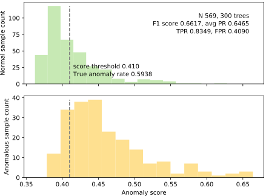

# Isolation Forest Implementation


The goal of this project is to implement the original [Isolation Forest](iforest_paper_icdm08b.pdf) algorithm by Fei Tony Liu, Kai Ming Ting, and Zhi-Hua Zhou.  (A later version of this work is also available: [Isolation-based Anomaly Detection](http://citeseerx.ist.psu.edu/viewdoc/download?doi=10.1.1.673.5779&rep=rep1&type=pdf).) There are two general approaches to anomaly detection: 

1. model what normal looks like and then look for nonnormal observations
2. focus on the anomalies, which are few and different. This is the interesting and relatively-new approach taken by the authors of isolation forests.


## Data sets

For this project, we'll use three data sets:

* [Kaggle credit card fraud competition data set](https://www.kaggle.com/mlg-ulb/creditcardfraud); download, unzip to get `creditcard.csv`

* Get cancer data into `cancer.csv` by executing [savecancer.csv](https://github.com/parrt/msds689/blob/master/projects/iforest/savecancer.py) that I provide.

* [http.zip](https://github.com/parrt/msds689/blob/master/projects/iforest/http.zip); download, unzip to get `http.csv`.

## Visualization of normal versus anomaly separation

Using [plot_anomalies.py](https://github.com/parrt/msds689/blob/master/projects/iforest/plot_anomalies.py), which I provide for you, you can see the results of the isolation forest trying to detect anomalies. These data sets all have known targets indicating normal versus anomaly, but this information is only used during testing and not during training. In other words, we use this information to discover how well we can separate the distribution of normal versus anomalous observations.  The section provides a number of results, but yours might look different because of the inherent randomness involved in selecting subsets of the data and constructing random trees. (click on the images to enlarge.)

<center>
<table border="0">
<tr><td>http.csv, 200 trees, 99% desired TPR</td></tr>
<tr>
<td border=0>
<a href="images/http-200-99.svg"></a>
</tr>
</table>
</center>

<table border="0">
<tr><td>creditcard.csv, 200 trees, 80% desired TPR</td><td>creditcard.csv, 200 trees, 90% desired TPR</td></tr>
<tr>
<td border=0>
<a href="images/creditcard-200-80.svg"></a>
<td border=0>
<a href="images/creditcard-200-90.svg"></a>
</tr>
</table>

<table border="0">
<tr><td> cancer, 300 trees, 70% desired TPR</td><td> cancer, 300 trees, 80% desired TPR</td></tr>
<tr>
<td border=0>
<a href="images/cancer-300-70.svg"></a>
<td border=0>
<a href="images/cancer-300-80.svg"></a>
</tr>
</table>

## Algorithm

For your convenience, here are the algorithms extracted from the Liu *et al* paper:

<table border="0">
<tr>
<td width="50%" valign="top"></td><td width="50%" valign="top"></td>
</tr>
<tr>
<td valign="top">

</td>
<td valign="top">
Please use this version of average path length <tt>c()</tt>, not the one in the original paper:<br>


<p>Then finally here's the scoring formula:<br>


<p>where "<i>H(i)</i> is the harmonic number and it can be estimated by <i>ln(i)</i> + 0.5772156649 (Euler’s constant)."
</td>
</tr>
</table>


## Scoring results

Using [score.py](https://github.com/parrt/msds689/blob/master/projects/iforest/score.py), here is a sample run:

```
Running noise=False improved=False
INFO creditcard.csv fit time 0.23s
INFO creditcard.csv 18804 total nodes in 200 trees
INFO creditcard.csv score time 14.54s
SUCCESS creditcard.csv 200 trees at desired TPR 80.0% getting FPR 0.0300%

INFO http.csv fit time 0.28s
INFO http.csv 22430 total nodes in 300 trees
INFO http.csv score time 23.08s
SUCCESS http.csv 300 trees at desired TPR 99.0% getting FPR 0.0053%

INFO cancer.csv fit time 0.08s
INFO cancer.csv 8204 total nodes in 1000 trees
INFO cancer.csv score time 0.73s
SUCCESS cancer.csv 1000 trees at desired TPR 75.0% getting FPR 0.2857%
```

Due to the subsampling of the original data said and the inherent random nature of isolation forest, your results will differ even from run to run.  I'm hoping that the variance is not so high that valid programs fail the scoring, but let me know.

